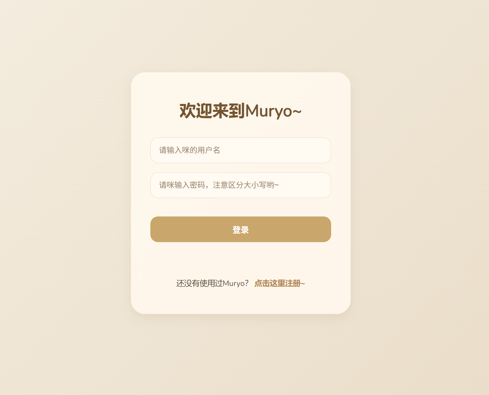
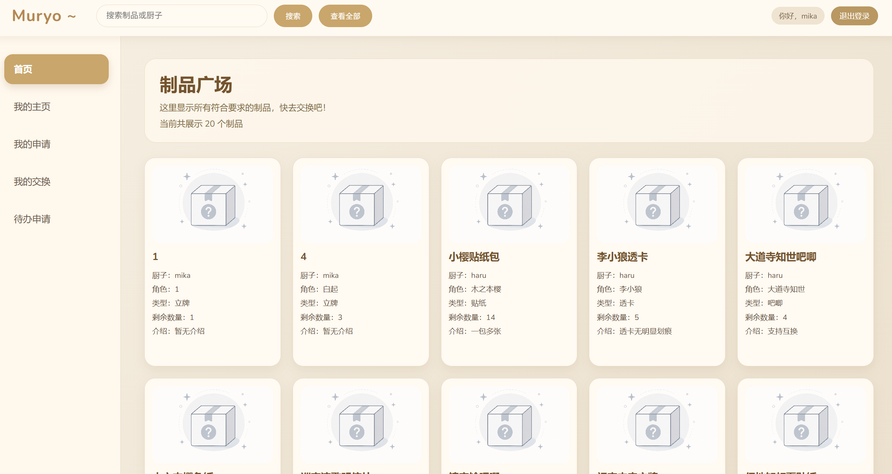
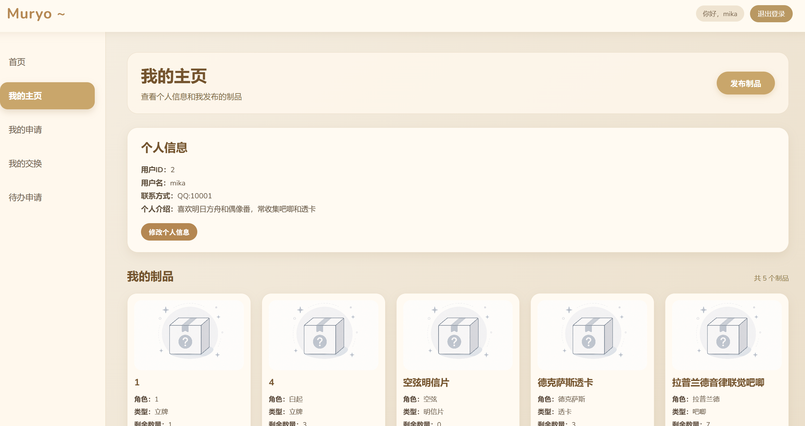
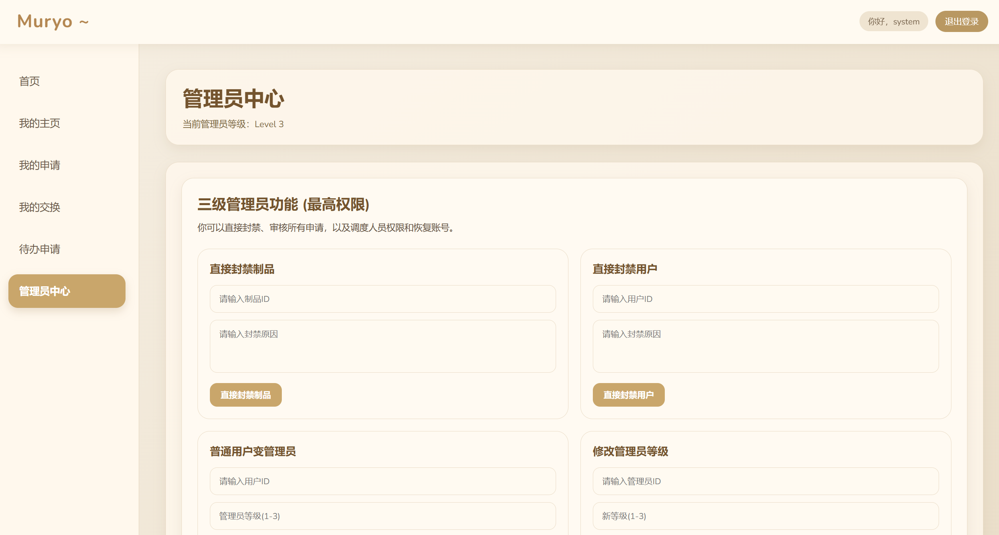

\# Muryo (无料) - 物料交换与管理平台 📦

> \*\*Muryo\*\* 是一款专为二次元同好设计的“谷子/无料（周边制品）”交换与流转管理系统。

\## 📖 项目背景与简介

本项目灵感来源于某二次元游戏每年五一假期的线下固定音乐活动。在线下“交换无料”的爱好交流中，常常面临以下痛点：

1\. \*\*多平台发帖导致管理混乱\*\*：跨社交平台发布无料帖，导致交换时需要多平台联系，极易造成遗漏。

2\. \*\*库存与余量难以统计\*\*：交换人数过多，个人难以实时追踪物品的余量状态。

3\. \*\*信息茧房\*\*：部分用户由于信息闭塞，难以找到同好进行交换。

\*\*Muryo 系统\*\* 应运而生，致力于提供一个统一、便捷、规范的无料制品交换与管理平台，让同好交流更加纯粹和高效。

\---

\## ✨ 核心功能模块

\### 👤 1. 用户系统

\* 注册与登录：安全可靠的账户系统。

\* 个人中心：支持修改个人信息。

\* 状态管理：涵盖正常、封禁、注销等完整生命周期。

\### 🏷️ 2. 制品 (物料) 管理

\* \*\*发布与搜索\*\*：支持发布制品信息，全局搜索找寻心仪物料。

\* \*\*详情与流转\*\*：查看制品详情，支持收藏，拥有者可删除名下制品。

\### 🔄 3. 交换流转核心 (Trade Flow)

\* \*\*发起申请\*\*：用户可一键向目标制品发起交换请求。

\* \*\*流程处理\*\*：被申请人可对申请进行 \*\*同意 / 拒绝\*\* 操作；同意后可标记 \*\*已完成\*\*，申请人亦可 \*\*取消\*\* 申请。

\### 🛡️ 4. 多级管理员与风控中心 (三级权限体系)

系统内置严格的三级管理员体系（管理员为用户实体的子实体），实现风控全流程闭环：

\* \*\*一级管理员 (L1)\*\*：拥有制品审核权。可删除违规制品，但需将删除申请提交至二级管理员审核。

\* \*\*二级管理员 (L2)\*\*：拥有高级审核与基础封禁权。可直接删除制品，可发起封禁违规用户申请（需提交至三级审核），同时负责审核 L1 的申请。

\* \*\*三级管理员 (L3 / 超管)\*\*：拥有系统最高权限。可直接删除制品、直接封禁用户；审核所有层级的待办申请；可恢复被封禁用户；拥有\*\*管理员调度权\*\*（普通用户提拔为管理员、管理员降级等）。

\---

\## 🛠️ 技术栈与环境依赖

\* \*\*后端开发\*\*：C++ (使用 Visual Studio 2022 编译)

\* \*\*数据库\*\*：MySQL 8.0 (原生 SQL 驱动)

\* \*\*前端展示\*\*：原生 HTML/CSS/JavaScript (AI 辅助生成框架，人工精调)

\* \*\*主要依赖库\*\*：

&#x20; \* `cpp-httplib`：用于搭建轻量级 HTTP/RESTful API 服务器。

&#x20; \* `mysql-connector-c++` 或 MySQL 原生 API：数据库连接与操作。

&#x20; \* `jsoncpp` (或同类 JSON 库)：前后端数据交互解析。

&#x20; \* 标准库与系统库：`iostream`, `string`, `windows.h`, `sstream` 等。

\---

\## 🚀 快速启动指南

\### 1. 数据库配置

1\. 确保本地已安装 \*\*MySQL 8.0\*\*。

2\. 数据库初始化：

&#x20;  \* 依次执行 `Database/muryo.sql` 以创建所有表结构与触发器/外键。

&#x20;  \* (可选) 执行 `Database/testdata.sql` 导入演示数据。

3\. \*\*关键配置项\*\*：打开后端源码中的 `main.cpp`（或对应的数据库连接配置文件），将 MySQL 的 `用户名`、`密码` 更改为你本地的数据库凭据。

&#x20;  

> \*\*⚠️ 初始数据提示\*\*：数据库必须预设一个 `id = 1` 的系统级默认用户，用于承接异常状态或系统默认归属以防止程序崩溃。

\### 2. 后端编译与运行

1\. 使用 \*\*Visual Studio 2022\*\* 打开 `muryo_backend.sln` 解决方案。

2\. 确保依赖库（`httplib`, `json`, `mysql`）已正确配置在项目属性的包含目录和库目录中。

3\. 编译并运行项目，后端服务器将开始监听配置的本地端口。

\### 3. 前端部署

为了避免由于本地直接打开 HTML 文件导致的跨域 (CORS) 问题：

1\. 使用 \*\*VS Code\*\* 打开前端文件夹。

2\. 安装并启动 \*\*Live Server\*\* 插件。

3\. 通过 Live Server 提供的本地地址（如 `http://127.0.0.1:5500`）在浏览器中访问系统前端界面。

\---

\## 📊 状态机与数据字典说明 (Developer Notes)

本系统对状态流转有着严格的设计，以下为数据库核心字段枚举说明（\*\*比较方式均不区分大小写，名称不可重复\*\*）：

| 实体 | 状态/字段 | 枚举值说明 |

| :--- | :--- | :--- |

| \*\*User (用户)\*\* | `status` | `1` 正常, `0` 封禁, `2` 注销 |

| \*\*Admin (管理员)\*\* | `level` | `1` 一级, `2` 二级, `3` 三级 (超级管理员) |

| \*\*Item (制品)\*\* | `status` | `0` 可交换, `1` 不可交换/已删除, `2` 已封禁 |

| \*\*Trade (交换申请)\*\*| `status` | `0` 未处理, `1` 已拒绝, `2` 待交换(已同意), `3` 已完成, `4` 已取消 |

| \*\*Trade (交换申请)\*\*| 角色关系 | `uto`: 申请人 (发起者), `ufrom`: 被申请人 (制品拥有者) |

| \*\*Audit (管理申请)\*\*| `status` | `0` 未处理, `1` 已同意, `2` 已拒绝 |

\---

\## 📸 系统截图

\---

\## 📜 声明与致谢

\* \*\*开发与贡献\*\*：本项目由 \*\*Cheria\*\* 借助 LLM 辅助工具独立设计与开发（LLM辅助工作主要为前端搭建）。

\* \*\*学术声明\*\*：本项目将作为 \*\*南开大学 2025 年第二学期《数据库系统》课程\*\* 的期末工程项目提交。

\* \*\*开源规范\*\*：本项目开源的初衷是分享交流与探讨数据库设计逻辑，欢迎学弟学妹在开发时参考借鉴思路。但\*\*坚决抵制任何形式的代码抄袭、“洗稿”及直接挪作他用的学术不端行为\*\*。

\* \*\*反馈\*\*：如果您对代码逻辑或系统架构有更好的优化建议，欢迎提交 Issue 进行学术探讨！

